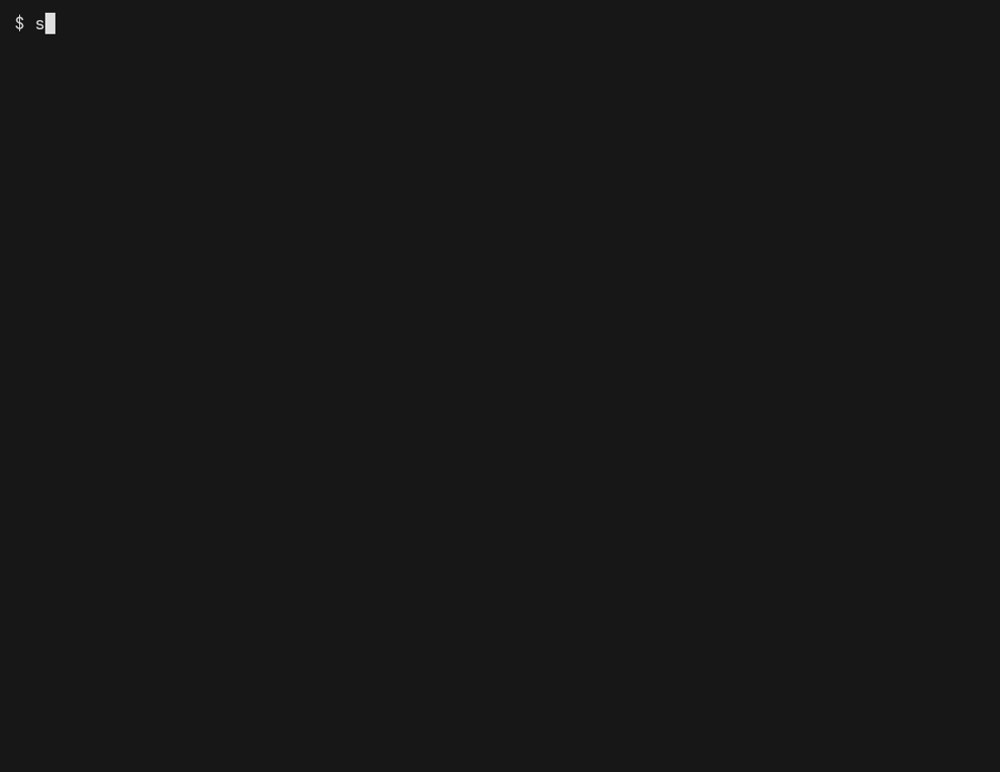

# End-to-end terminal recordings (VHS)

This directory drives the **real `skillz` binary through its TUI** — one
[VHS](https://github.com/charmbracelet/vhs) tape per command flow — and produces
two artifacts per flow from a single recording:

| Artifact | Purpose |
| --- | --- |
| `<flow>-flow.gif` | Animated demo for PRs / README |
| `<flow>-flow.golden.txt` | Final-frame text snapshot, diffed in CI as an integration test |



The same recording is both the demo *and* the assertion: one tape, one run.

## Why a recording (we already have snapshot tests)

The in-process tests (`Skillz.Tests`) drive the prompts through Spectre's
`TestConsole` — fast and deterministic, but they never exercise the *compiled*
binary: `Program.cs`, DI wiring, `System.CommandLine` parsing, or real terminal
rendering. This tier does, end to end, through a real PTY. It is the slow,
high-confidence layer — a handful of representative flows, not exhaustive.

## The flows

| Flow | Drives | Validates |
| --- | --- | --- |
| `add` | interactive: skill multi-select → searchable agent picker → scope → method → confirm | the full interactive install, **symlink** path |
| `copy` | `add --agent claude-code --copy --skill … -y` | non-interactive install, **copy** path + `Copied:` summary |
| `global` | `add --agent claude-code --global --skill … -y` | **global scope** (`$HOME`-rooted paths) |
| `init` | `init my-skill` | skill scaffolding + next-steps output |
| `list` | `list` (after a hidden install) | the installed-skills table |
| `remove` | interactive: multi-select → y/n confirm → summary | **interactive removal** + lock/symlink cleanup |
| `update` | interactive scope picker → Both | the update check (hermetic: local skills are never network-checked) |
| `error` | `add ./missing` | the **failure UX**: error message + non-zero exit |

Each flow's tape is the source of truth; keep `MARKERS`/`ALL_FLOWS` in
[`run.sh`](run.sh) in sync with the tape set.

## How it works

```
<flow>-flow.tape ──▶ VHS container (ttyd + ffmpeg) ──▶ <flow>-flow.gif
                                                   └──▶ <flow>-flow.txt ──▶ extract-frame.sh ──▶ diff vs golden
```

1. **`<flow>-flow.tape`** is a VHS script. Interactive flows gate each keystroke
   on a `Wait+Screen /.../` sentinel, so the recording syncs on **state**, not
   wall-clock timing (no flaky `Sleep`s). A hidden setup block puts the published
   binary on `PATH`, works in a throwaway `/tmp/work`, and (for `list`/`remove`/
   `update`) pre-installs fixtures so the demo has real state.
2. **`run.sh`** publishes a self-contained `linux-x64` binary once, then for each
   flow mounts the repo read-only into the pinned VHS container and records.
3. **`extract-frame.sh`** reduces VHS's multi-frame `.txt` capture to the final
   completed frame, keyed on a per-flow marker (e.g. `Done!`, `Successfully removed`).
4. Each frame is diffed against `<flow>-flow.golden.txt`.

## Running it

```bash
./test/e2e/run.sh                 # record + verify EVERY flow (what CI does)
./test/e2e/run.sh remove update   # record + verify only the named flows
./test/e2e/run.sh --update        # accept new output: refresh all goldens + GIFs
./test/e2e/run.sh --update init   # refresh a single flow
REBUILD=1 ./test/e2e/run.sh       # force re-publish of the binary first
```

`run.sh` exits non-zero if any flow's frame differs from its golden (**FAIL**) or
has no golden yet (**NEW**), and collects the changed/new GIFs, frames, and diffs
under `out/report/` for CI.

Requirements: `docker` + the .NET SDK. Nothing else — `ttyd`, `ffmpeg`, and the
fonts are baked into the pinned container.

**In this repo's devcontainer**, both are provided as features (Docker via
`docker-in-docker`, .NET 10 via the `dotnet` feature) — run **Dev Containers:
Rebuild Container** once, then `./test/e2e/run.sh` works as above. Docker-in-Docker
needs a host that permits privileged containers.

## What makes it deterministic

Two independent runs produce a **byte-identical** final frame. The levers:

- **Assert on text, never on the GIF.** GIF bytes go through ffmpeg/gifski and are
  not stable across versions/platforms. The character grid (`.txt`) is.
- **Final frame only.** Intermediate frames vary with timing; the end state does not.
- **Pinned VHS image** (by digest) — a new VHS release can't silently reflow output.
- **Fixed geometry / theme / `CursorBlink false`** in every tape.
- **Hermetic inputs**: a local fixture (no network), a fixed `/tmp/work` cwd, and a
  pinned `$HOME` where it appears in output, so every path is constant. A clean
  container has no agent env (`AI_AGENT`, `CLAUDECODE`, …) and no agent config, so
  skillz renders the real interactive prompts with stable defaults.
- **One skill where order matters.** The install report lists skills in discovery
  order (filesystem-dependent), so the non-interactive `copy`/`global`/`list` flows
  pin a single skill with `--skill`. `remove` lists skills sorted, and `update`
  never enumerates local skills, so those use all three fixtures.

If skillz legitimately changes its output (e.g. a new universal agent), the diff
fails — that's the test working. Re-run with `--update <flow>` and commit the new
golden + GIF.

## CI: artifacts + PR comment

The [`e2e-demo`](../../.github/workflows/e2e-demo.yml) workflow records and verifies
every flow on pushes and PRs that touch the CLI, the tapes, or the fixtures, and:

- **Uploads** all GIFs plus `out/report/**` (changed frames, diffs, per-flow status)
  as the `skillz-e2e-snapshots` build artifact.
- On a **PR**, posts a single collapsed comment — one expandable `<details>` per
  flow that **changed** (🔴) or is **new** (🆕) — with the recording inline. The
  GIFs are hosted on an `e2e-snapshots` side branch so GitHub renders them in the
  comment. When everything matches, the comment resets to a ✅ line.
- **Fails the job** (after uploading + commenting) if any flow changed or is new.

> Inline hosting needs write access, so it is skipped for **fork** PRs (the GIFs
> are still in the artifact). Same-repo PRs get the inline previews.

## Files

| File | |
| --- | --- |
| `<flow>-flow.tape` | The VHS script for a flow (source of truth) |
| `<flow>-flow.golden.txt` | Committed final-frame snapshot |
| `<flow>-flow.gif` | Committed demo (regenerate with `run.sh --update <flow>`) |
| `run.sh` | Publish → record each flow → extract → verify/update + build report |
| `extract-frame.sh` | VHS `.txt` → final frame (per-flow marker) |
| `bin/`, `out/` | gitignored: published binary, raw recordings, report |

Fixture skills live in [`../fixtures/sample-skills`](../fixtures/sample-skills).
